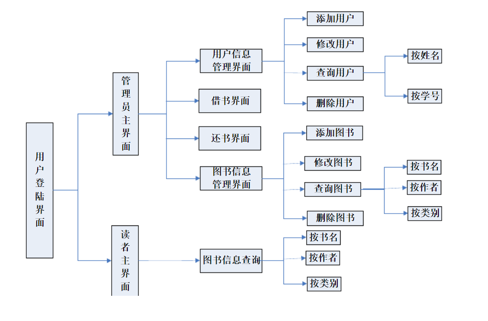
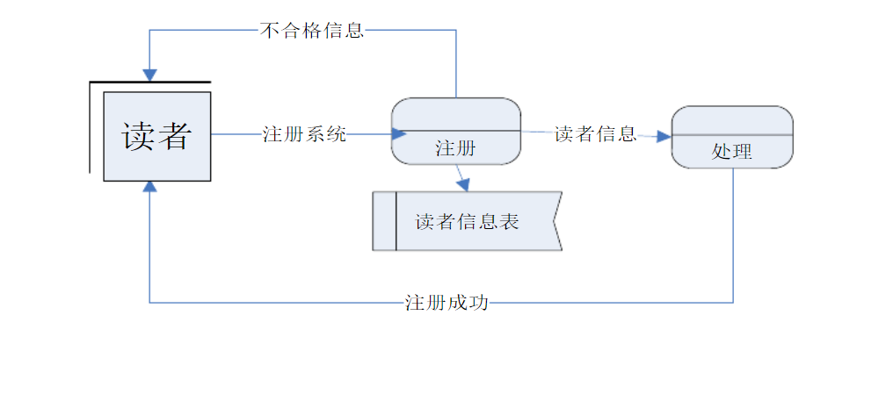

**期末项目设计报告**

| 题 目    | 基于Oracle的图书管理系统的数据库设计 |      |              |
|----------|--------------------------------------|------|--------------|
| 课程     | Oracle数据库应用                     |      |              |
| 学 院    | 计算机学院                           |      |              |
| 专 业    | 软件工程                             | 年级 | 2018级       |
| 学生姓名 | 陈奕妍                               | 学号 | 201810414101 |
| 指导教师 | 赵卫东                               | 职称 | 副教授       |

| **评分项**   | **评分标准**                 | **满分** | **得分** |
|--------------|------------------------------|----------|----------|
| 文档整体     | 文档内容详实、规范，美观大方 | 10       |          |
| 表设计       | 表，表空间设计合理，数据合理 | 20       |          |
| 用户管理     | 权限及用户分配方案设计正确   | 20       |          |
| PL/SQL设计   | 存储过程和函数设计正确       | 30       |          |
| 备份方案     | 备份方案设计正确             | 20       |          |
| **得分合计** |                              |          |          |

2021 年 6 月 2 日

[TOC]

# 1、概述 

## 1.1 设计意图

在高校中，学生的数量较多，图书的数量也比较多，每天图书的借阅量比较大，采用手工的处理方式已经不能满足这种需要了，因此需要开发一个能够处理平时借阅处理的信息系统，这个信息系统负责主要处理图书馆日常的借书、还书和各种关于图书业务的办理。为方便对图书馆书籍，读者资料，借还书等进行高效的管理，特编写该程序以提高图书馆的管理效率。

# 2、需求分析

图书馆管理信息系统的功能模块图

## 2.1 功能概述

本图书馆管理系统主要实现了一下几大块的功能:首先是对图书数据的管理包括新书的录入，根据各种前提条件的图书检索(例如按照图书所属种类、按照入库日期、按照图书现存状态)，图书馆中图书情况的统计分析功能(图书总量、在借图书总量、借阅次数、对于淘汰、损坏、丢失图书等信息的统计);其次，可以实现对使用者的注册，使用者基本信息的查询，使用者借阅记录的查询以及对借阅超期、丢失图书的处理;能够对使用该管理系统的用户进行管理，按照不同的工作职能提供不同的功能授权，图书管理员可以对所有用户信息、基本信息、借书、还书进行操作，而用户(包括学生、教师只能查看其自己的相关信息记录)。

### 2.1.1 管理员信息管理

管理员是本系统的管理者，具有最高权限，对图书和读者有添加，修改和删除等功能。但管理员只能修改自己的信息，不能添加或删除自己的信息。要想添加和删除管理员必须到数据库中去操作表结构。

### 2.1.2 借阅者信息管理

由系统管理员，给每个借阅者创建一个账户，账户应具有借阅者的详细信息，并且借阅者的信息在借阅者的身份信息改变后可以修改或注销。

### 2.1.3 图书管理

1）新增书籍。图书管理员对新增的入库文献资料按规定进行编目、编录、加工、建库。对每本图书、杂志要登记其基本信息，包括图书名称、图书作者、ISBN号、出版地、出版社、出版时间、字数、单价、内容简介、所属分类号，馆藏地、入库时间等。

2）书籍信息维护。图书管理员可以对入库的书籍信息进行修改，或是删除该书籍信息，如采购书籍册数。

3）书籍类别管理。新增书籍按照中图法分类规则进行分类。

4）书籍借阅管理。图书管理员根据不同类型读者的借阅情况，对书籍进行管理。

### 2.1.4 图书出借管理

图书馆代理借阅者进行借书或者还书等各项义务。在借阅书刊时，只要输入要借阅的书刊编号然后输入借阅者的ID，即可提交借书操作。若书刊编号存在，且借阅卡号存在，且借阅卡的信息与借阅者本人的信息吻合，收取一定押金后即可完成借书操作。完成借书操作后，数据库内书库记录该书刊的记录从在库状态改为借出状态。则操作成功，系统会把该本书的加入借阅记录中去。

### 2.1.5 图书归还管理

管理员可以根据借阅者的关键信息，查询到该借阅者所有的借阅信息，借阅日期等，从中选择要归还的图书，显示有关本图书的所有借阅信息，方便让管理员判断出是否过期，是否对读者进行罚款，退还押金后并对数据库记录做出改变，并把该本图书状态信息改为在库。

### 2.1.6 借阅图书管理

图书管理员要能够对所有被借出的书进行查询，了解哪些人借了哪些书，以及借阅书籍的日期，方便当一本书借出太久后管理员可以对该借书的人进行通知。

## 2.2 需求分析图

### 2.2.1 功能分析图

### 2.2.2 流程图

图2.1 注册读者信息流程图

图2.2 管理员录入图书流程图

图2.3 借书还书流程图

# 3、概念设计

## 3.1 实体 

读者信息，图书信息，图书管理员信息。

## 3.2 E-R图

（1）读者——借阅——图书

图3.1 借阅关系E-R图

事务规则： 一个读者可以借阅多本图书(1: n)

一本图书可以被一个读者借阅(1: n)

（2）管理员——管理——读者

图3.2 管理员读者关系E-R图

事务规则: 一个图书管理员可以管理多个读者信息(1: n)

一个读者信息只能被一个图书管理员管理(1: 1)

（3）管理员——管理——图书

图3.3 管理员书籍关系E-R图

（4）全局ER模型

在得到全局ER模式后，为了提高数据库系统的效率，还应进一步
依据处理需求对ER模式进行优化。一个好的全局ER模式，除能准确、全面地反映用户功能需求外，还应满足下列条件：实体类型的个数要尽可能的少；实体类型所含属性个数尽可能少；实体类型间联系无冗余。综上所述，“图书管理统”的全局ER模式如下图所示。

图3.4 全局E-R图

# 4、系统结构设计

## 4.1 概念模型设计

## 4.2 逻辑模型设计

在得出概念结构设计的E-R图后，下一步的任务就是吧概念结构设计中的E-R模型转换为具体的数据库管理系统支持的组织层数据模型，也就是导出特定的数据库管理系统可以处理的数据库逻辑结构，由于在概念结构设计中我们就得出了若干个关系模式，因此在逻辑结构设计要做的就是把各个关系模式做一遍规范化处理，以减少冗余。以下关系模式均已规范化到第三范式。

图书表（图书编号，图书类别编号，书名，出版日期，作者，出版社，ISBN号，价格）

图书类别表（类别编号，类别名称，类别解释）

借阅者表（借阅者编号，借阅等级，姓名，性别，照片，电话，已借图书）

借阅者类别表（借阅等级，等级名称，最大可借图书数，最长借阅期限）

管理员表（管理员编号，姓名，性别，登陆密码，电话，照片）

罚金表（罚金级别，罚金名称，罚款说，罚金数量）

借书记录表（借阅者编号，图书编号，借书时间，还书期限，押金）

还书记录表（借阅者编号，图书编号，还书时间，退款）

罚款表（借阅者编号，罚款类别，已缴罚款，罚款原因）

## 4.3 物理模型设计

# 5、表设计

>   /\*第1步：创建临时表空间 \*\*/

>   create temporary tablespace user_temp

>   tempfile 'D:\\oracle\\oradata\\Oracle9i\\user_temp.dbf'

>   size 50m

>   autoextend on

>   next 50m maxsize 20480m

>   extent management local;

>   /\*第2步：创建数据表空间 \*/

>   create tablespace user_data

>   logging /\*logging 是对象的属性，创建数据库对象时，oracle
>   将日志信息记录到练级重做日志文件中。代表空间类型为永久型 \*/

>   datafile 'D:\\oracle\\oradata\\Oracle9i\\user_data.dbf'

>   size 50m

>   autoextend on /\*autoextend on 表空间大小不够用时自动扩展\*/

>   next 50m maxsize 2048m /\*next 50m 自动扩展增量为50MB \*/

>   extent management local; /\*extent management local 代表管理方式为本地\*/

>   /\*第3步：创建用户并指定表空间 \*/

>   create user username identified by password

>   default tablespace user_data

>   temporary tablespace user_temp;

>   /\*第4步：给用户授予权限 \*/

>   grant connect,resource,dba to username;

>   通过之前的概念结构设计，逻辑结构设计，物理结构设计得出来的模型可以知道，本图书管理系统大概有十张表，这些表从业务角度来分，主要有以下三类：

>   （1）与书库相关的表。包括图书表

>   （2）与系统角色相关的表，包括借阅者表，管理员表

>   （3）与案例业务相关的表，借书表，还书表。

>   除了这些表外，其他都是些参数类型的表。在我们的案例中，本系统是面向小型图书馆的。下面我们以一个借阅人数为500，藏书量为10000本的图书馆为例。有五百个借阅者需要建立借阅信息，10000本图书需要建立图书信息。预设10位管理员。粗略估算一下数据表空间为2G，索引表也设为2G，临时表空间设为500M。由于本系统大多数操作都是通过管理员进行的，并发性不高，所以回退表空间不需要很大，回退表空间就设为500M。

>   综上所述，本案例需要创建一个数据表空间，一个索引表空间，一个临时表空间并将回退表空间扩充，为其增加一个数据文件。

>   建立表空间代码：

>   declare

>   num number;

>   begin

>   select count(1) into num from BORROW

>   where TABLE_NAME = 'READERID';

>   if num=1 then

>   execute immediate 'drop table READERID cascade constraints PURGE';

>   end if;

>   select count(1) into num from BORROW where TABLE_NAME = 'BOOKID';

>   if num=1 then

>   execute immediate 'drop table BOOKID cascade constraints PURGE';

>   end if;

>   end;

>   //表空间 users

>   TABLESPACE USERS

>   PCTFREE 10

>   INITRANS 1

>   STORAGE

>   (

>   BUFFER_POOL DEFAULT

>   )

>   NOCOMPRESS

>   NOPARALLEL

>   PARTITION BY RANGE (READERID)

>   (

>   PARTITION PARTITION_2015 VALUES LESS THAN (TO_DATE(' 2016-01-01 00:00:00',
>   'SYYYY-MM-DD HH24:MI:SS', 'NLS_CALENDAR=GREGORIAN'))

>   NOLOGGING

>   TABLESPACE USERS

>   PCTFREE 10

>   INITRANS 1

>   STORAGE

>   (

>   INITIAL 8388608

>   NEXT 1048576

>   MINEXTENTS 1

>   MAXEXTENTS UNLIMITED

>   BUFFER_POOL DEFAULT

>   )

>   NOCOMPRESS NO INMEMORY, PARTITION PARTITION_2016 VALUES LESS THAN (TO_DATE('
>   2017-01-01 00:00:00', 'SYYYY-MM-DD HH24:MI:SS', 'NLS_CALENDAR=GREGORIAN'))

>   NOLOGGING

>   TABLESPACE USERS

>   PCTFREE 10

>   INITRANS 1

>   STORAGE

>   (

>   BUFFER_POOL DEFAULT

>   )

>   NOCOMPRESS NO INMEMORY, PARTITION PARTITION_2017 VALUES LESS THAN (TO_DATE('
>   2018-01-01 00:00:00', 'SYYYY-MM-DD HH24:MI:SS', 'NLS_CALENDAR=GREGORIAN'))

>   NOLOGGING

>   TABLESPACE USERS

>   PCTFREE 10

>   INITRANS 1

>   STORAGE

>   (

>   BUFFER_POOL DEFAULT

>   )

>   NOCOMPRESS NO INMEMORY, PARTITION PARTITION_2018 VALUES LESS THAN (TO_DATE('
>   2019-01-01 00:00:00', 'SYYYY-MM-DD HH24:MI:SS', 'NLS_CALENDAR=GREGORIAN'))

>   NOLOGGING

>   TABLESPACE USERS02

>   PCTFREE 10

>   INITRANS 1

>   STORAGE

>   (

>   BUFFER_POOL DEFAULT

>   )

>   NOCOMPRESS NO INMEMORY, PARTITION PARTITION_2019 VALUES LESS THAN (TO_DATE('
>   2020-01-01 00:00:00', 'SYYYY-MM-DD HH24:MI:SS', 'NLS_CALENDAR=GREGORIAN'))

>   NOLOGGING

>   TABLESPACE USERS02

>   PCTFREE 10

>   INITRANS 1

>   STORAGE

>   (

>   BUFFER_POOL DEFAULT

>   )

>   NOCOMPRESS NO INMEMORY, PARTITION PARTITION_2020 VALUES LESS THAN (TO_DATE('
>   2021-01-01 00:00:00', 'SYYYY-MM-DD HH24:MI:SS', 'NLS_CALENDAR=GREGORIAN'))

>   NOLOGGING

>   TABLESPACE USERS02

>   PCTFREE 10

>   INITRANS 1

>   STORAGE

>   (

>   BUFFER_POOL DEFAULT

>   )

>   NOCOMPRESS NO INMEMORY, PARTITION PARTITION_2021 VALUES LESS THAN (TO_DATE('
>   2022-01-01 00:00:00', 'SYYYY-MM-DD HH24:MI:SS', 'NLS_CALENDAR=GREGORIAN'))

>   NOLOGGING

>   TABLESPACE USERS03

>   PCTFREE 10

>   INITRANS 1

>   STORAGE

>   (

>   BUFFER_POOL DEFAULT

>   )

>   NOCOMPRESS NO INMEMORY

>   );

>   TABLESPACE USERS

>   PCTFREE 10

>   INITRANS 1

>   STORAGE (BUFFER_POOL DEFAULT )

>   NOCOMPRESS

>   NOPARALLEL

>   PARTITION BY REFERENCE (order_details_fk1);

>   declare

>   dt date;

>   number(8,2);

>   V_EMPLOYEE_ID NUMBER(6);

>   v_order_id number(10);

>   v_name varchar2(100);

>   v_tel varchar2(100);

>   v number(10,2);

>   v\_reader\_id number;

>   begin

>   v\_ reader\_id:=1;

>   delete from reader;

>   for i in 1..10000

>   loop

>   if i mod 6 =0 then

>   dt:=to_date('2015-3-2','yyyy-mm-dd')+(i mod 60);

>   elsif i mod 6 =1 then

>   dt:=to_date('2016-3-2','yyyy-mm-dd')+(i mod 60);

>   elsif i mod 6 =2 then

>   dt:=to_date('2017-3-2','yyyy-mm-dd')+(i mod 60);

>   elsif i mod 6 =3 then

>   dt:=to_date('2018-3-2','yyyy-mm-dd')+(i mod 60); --PARTITION_2018

>   elsif i mod 6 =4 then

>   dt:=to_date('2019-3-2','yyyy-mm-dd')+(i mod 60);

>   else

>   dt:=to_date('2020-3-2','yyyy-mm-dd')+(i mod 60);

>   end if;

# 6、用户管理

用户是数据库的使用者和管理者，Oracle通过设置用户及安全属性来控制用户对数据库的访问。Oracle的用户分两类，一类是创建数据库时系统预定义的用户，一类是根据应用由DBA创建的用户。

## 6.1 预定义用户

在oracle创建时创建的用户，我们称为预定义用户，预定义用户根据作用不同分为3类：

管理员用户：包括SYS,SYSTEM,SYSMAN,DBSNMP等。SYS是数据库中拥有最高权限的管理员，可以启动、关闭、修改数据库，拥有数据字典；SYSTEM是一个辅助的数据库管理员，不能启动和关闭数据库，但是可以进行一些管理工作，如创建和删除用户；SYSMAN是OEM的管理员，可以对OEM进行配置和管理；DBSNMP用户是OEM代理，用来监视数据库的。以上这些用户都不能删除。

示例方案用户：在安装Oracle或使用odbc创建数据库时，如果选择了”示例方案”，会创建一些用户，在这些用户对应的schema中，有产生一些数据库应用案例。这些用户包括：BI、HR、OE、PM、IX、SH等。默认情况下，这些用户均为锁定状态，口令过期。

内置用户：有一些Oracle特性或Oracle组件需要自己单独的模式，因此为他们创建了一些内置用户。如APEX_PUBLIC_USER、DIP等。默认情况下，这些用户均为锁定状态，口令过期。

此外还有2个特殊的用户SCOTT和PUBLIC，SCOTT是一个用于测试网络连接的用户，PUBLIC实际是一个用户组，数据库中任何用户都属于该用户组，如果要为数据库中的全部用户授予某种权限，只需要对PUBLIC授权即可。

## 6.2 用户属性

在创建用户时，必须使用安全属性对用户进行限制，用户的安全属性主要包括：

用户名：在同一个数据库中，用户名是唯一的，并且不能与角色名相同；

用户身份认证：Oracle采用多种方式进行身份认证，如数据库认证、操作系统认证、网络认证等；

默认表空间：用户创建数据库对象时，如果没有显式指明存储在哪个表空间中，系统会自动将该数据库对象存储在当前用户的默认表空间，在Oracle
11g中，如果没有为用户指定默认表空间，则系统将数据库的默认表空间作为用户的默认表空间；

临时表空间：临时表空间分配与默认表空间相似，如果不显式指定，系统会将数据库的临时表空间作为用户的临时表空间；

表空间配额：表空间配额限制用户在永久表空间中可以使用的存储空间的大小，默认新建用户在表空间都没有配额，可以为每个用户在表空间上指定配额，也可授予用户UMLIMITED
TABLESPACE系统权限，使用户在表空间的配额上不受限制。不需要分配临时表空间的配额；

概要文件：每个用户必须具有一个概要文件，从会话级和调用级两个层次限制用户对数据库系统资源的使用，同时设置用户的口令管理策略。如果没有为用户指定概要文件，Oracle将自动为用户指定DEFAULT概要文件；

设置用户的默认角色

账户状态：创建用户时，可以设定用户的初始状态，包括口令是否过期和账户是否锁定等。

创建用户，权限角色管理代码：

create user C\#\#Reader identified by 123456;

create user C\#\#Operater identified by 234567;

create role C\#\#borrow;

create role C\#\#sale;

grant C\#\#borrow to C\#\#Reader;

grant C\#\#sale to C\#\#Operater;

grant create session, create table to C\#\#Reader;

grant connect,resource to C\#\#Operater;

# 7、表、约束、索引、视图管理

## 7.1 表管理

1、认识表

基本存储单位

二维结构

行和列

2、约定

每一列数据必须具有相同数据类型

列名唯一

每一行数据的唯一性

3、数据类型

字符型：CHAR(n[max:2000])、NCHAR(n[max:1000])、VARCHAR2(n[max:4000])、NVARCHAR2(n[max:2000])

数值型：NUMBER(p,s) p：有效数字；s：小数点后的位数、FLOAT(n)

日期型：DATE、TIMESTAMP

其它类型：BLOB、CLOB

数据类型中可以表示可变长度的字符有nvarchar2和varchar2。

nvarchar2和varchar2都可以表示可变长度的字符，其中nvarchar2用于存储Unicode格式的数据，更适合存储中文数据。

4、创建表

CREATE TABLE table_name

(

column_name datatype, ...

);

创建用户表，示例如下：

create table user

(

id number(6,0),

username varchar2(20),

userpwd varchar2(20),

email varchar2(30),

regdate date

);

5、修改表

添加字段

ALTER TABLE table_name ADD column_name datatype;

alter table userinfo add remarks varchar2(500);

更改字段数据类型

ALTER TABLE table_name MODIFY column_name datatype;

alter table userinfo modify remarks varchar2(400);

alter table userinfo modify userpwd number(6,0);

删除字段

ALTER TABLE table_name DROP COLUMN column_name;

alter table userinfo drop column remarks;

修改字段名

ALTER TABLE table_name RENAME COLUMN column_name TO new_column_name;

alter table userinfo rename column email to new_email;

修改表名

RENAME table_name TO new_table_name;

rename userinfo to new_userinfo;

6、删除表

\# 清除表数据

TRUNCATE TABLE table_name;

truncate table new_userinfo;

\# 删除表数据及结构

DROP TABLE table_name;

drop table new_userinfo;

7、添加数据

INSERT语句

INSERT INTO table_name(column1,column2,...) VALUES(value1,value2,...)

insert into userinfo values(1,'xxx','123','xxx@126.com',sysdata);

insert into userinfo(id,username,userpwd) values(2,'yyy','123');

create table user1

(

id number(6,0),

regdate date default sysdate

);

CREATE TABLE table_new

AS

SELECT column1,...\|\* FROM table_old

INSERT INTO table_new [(column1,...)]

SELECT column1,...\|\* FROM table_old

8、修改表数据

UPDATE语句

UPDATE table_name SET column1 = value1,... [WHERE conditions]

9、删除数据

DELETE语句

DELETE FROM table_name [WHERE conditions]

表是ORACLE数据库中的主要对象，是数据库中的数据存储的基本单位，存储着与应用程序相关的一些信息。其他许多数据库对象如索引、视图都以表为基础。下面我们将以前面概念模型设计通过正向工程生成的物理数据模型进一步生成的数据库创建的SQL脚本来建表。

## 7.2 建表

创建表代码：

CREATE TABLE "BOOK" (

"BOOKID" VARCHAR(20) NOT NULL,

"CLASSID" VARCHAR(20) NOT NULL,

"BOOKNAME" VARCHAR(20),

CONSTRAINT pk_BOOK PRIMARY KEY ("BOOKID")

);

Book: '图书基本信息表';

Book.BookId: '主键: 具有唯一一性';

Book.classId: '外键，引用图书类别表中图书所属的类别';

Book.Bookname: '书名';

创建管理员表

CREATE TABLE "MANMER" (

"ID" VARCHAR(20) NOT NULL,

"NAME" VARCHAR(20) NOT NULL,

"SEX" VARCHAR(20),

CONSTRAINT pk_MANGER PRIMARY KEY ( "ID" )

);

Manger: '管理员信息';

Manger.ID: '主键: 唯一标识管理员';

Manger.name: '姓名';

Manger.sex: '性别';

创建借阅者表

CREATE TABLE "READER" (

"ID" VARCHAR(20) NOT NULL,

"READERID" VARCHAR(20) NOT NULL,

"READERCLASS" VARCHAR(20) NOT NULL,

"READERNAME" VARCHAR(20),

CONSTRAINT pk_READER PRIMARY KEY ("ID")

);

创建借阅书籍信息表

CREATE TABLE "BORROW" (

"ID" VARCHAR(20) NOT NULL,

"READERID" VARCHAR(20) NOT NULL,

"BOOKID" VARCHAR(20) NOT NULL,

"BORROWDATA" DATETIME,

"EXPECTRETURNDATE" DATETIME,

CONSTRAINT pk_READER PRIMARY KEY ("ID")

);

创建归还图书信息表

CREATE TABLE "RETURN" (

"READERID" VARCHAR(20) NOT NULL,

"BOOKID" VARCHAR(20) NOT NULL,

"BORROWDATA" DATETIME,

"RETURNDATE" DATETIME,

CONSTRAINT pk_READER PRIMARY KEY ("READERID")

);

创建借阅等级表

CREATE TABLE "READERCLASS" (

"READERCLASS" VARCHAR(20) NOT NULL,

"READERCLASSNAME" VARCHAR(20) NOT NULL,

"MAXBORROW" VARCHAR(20),

CONSTRAINT pk_READERCLASS PRIMARY KEY ("READERCLASS")

);

创建图书类别表

CREATE TABLE "CLASSIDTABLE" (

"CLASSID" VARCHAR(20) NOT NULL,

"CLASSNAME" VARCHAR(20) NOT NULL,

"CLASSEXPLAIN" VARCHAR(20),

CONSTRAINT pk_CLASSIDTABLE PRIMARY KEY ("CLASSID")

);

## 7.3 约束 

完整性约束是一种规则，它不占任何数据空间完整性约束存在数据字典中，在执行SQL或PL/SQL期间使用。用户可以指明约束

是启用的还是禁用的，当约束启用时，他增强了数据的完整性，否则，则反之，但约束始终存在于数据字典中。约束大致分为唯一性和主键约束、外键约束、检查约束、空值约束、默认值约束，等，对于本例来说，主要是应该添加外键约束，检查约束，和默认值约束。例如，管理员表和借阅者表的性别字段应该添加检查约束，还有一些表与表之间的引用应该添加外键约束。

## 7.4 索引管理

### 7.4.1. Oracle 索引简介

在 Oracle 数据库中，存储的每一行数据都有一个 rowID 来标识。当 Oracle
中存储着大量的数据时，意味着有大量的 rowID ，此时想要快速定位指定的 rowID
，就需要使用索引对象。

当对 Oracle
表执行指定条件的查询时，常规的方法是将所有的记录取出来，然后再把每一条记录与查询条件作对比，最后返回满足条件的记录。这样操作不仅耗费时间并耗费资源。当有了索引之后，只需要在索引中找到符合查询条件的索引字段值，就可以通过保存在索引中的
rowID 快速找到表中对应的记录。

用户可以根据情况不同创建多种类型的索引。按照索引的存储方式将索引分为 B
树索引、位图索引、反向索引和基于函数的索引。创建索引时需要注意以下几点：

（1）索引应该建立在 where
子句频繁引用、排序以及分组的列上，如果选择的列不合适将无法提升查询速度；

（2）限制索引的个数。索引只要提升查询速度，但会降低 DML 操作的速度；

（3）指定索引块空间的使用参数。基于表建立索引时， Oracle
会将相应表添加到索引块。为索引添加数据时， Oracle 会按照 pctfree
参数在索引块上预留部分空间。如果将来在表上执行大量的 insert
操作，那么应该在建立索引时设置较大的 pctfree ；

（4）将表和索引部署到相同的表空间，可以简化表空间的管理；将表和索引部署到不同的表空间，可以提高访问性能（
Oracle 能够并行读取不同硬盘的数据）；

### 7.4.2 创建索引

在创建索引时， Oracle
首先对将要简历索引的字段进行排序，然后将排序后的字段值和对应记录的 rowID
存储在索引段中。查询时，根据索引查询指定条件的 rowID ，再根据 rowID 提取数据行。

### 7.4.3 修改索引

修改索引使用 alter index
完成。为表建立索引后，随着对表不断进行更替、插入和删除动作，索引中国会产生越来越多的存储碎片，导致索引工作效率降低。这是可以采取重建索引和合并索引清除碎片。合并索引只是将
B 树中叶子节点的存储碎片合并在一起，并不会改变索引的物流组织结构。

合并索引：

Alter index index_test

Coalesce deallocate unused ;

重建索引：

Alter index index_test rebuild

Tablespace user 1；

重建索引时可以更改索引的类型，存储表空间等

### 7.4.4 删除索引

删除索引使用 drop index
语句。当索引过于碎片化，或者不经常被用到时，既可以删除索引：

Drop index index_test ；

## 7.5 视图管理

视图是从一个表或多个表中通过查询二导出数据的虚表，建立视图并不占据空间。在本案例中在Reader表中有个已借图书数量borrowed，和readerclass，而在Readerclass表中规定了一个等级的用户可以借多少书，因此我们可以通过它来创建一个视图从而显示出用户还能借多少本图书。步骤如下：创建视图
从视图中选择数据就这样管理员就可以方便地判断是否可以将书籍出借给借阅者了，或者还可以对视图进行修改。

# 8、PL/SQL设计

## 8.1 SQL与PL/SQL

### 8.1.1 什么是PL/SQL？

PL/SQL是 Procedure Language & Structured Query Language
的缩写。PL/SQL是对SQL语言存储过程语言的扩展。从ORACLE6以后，ORACLE的RDBMS附带了PL/SQL。它现在已经成为一种过程处理语言，简称PL/SQL。目前的PL/SQL包括两部分，一部分是数据库引擎部分；另一部分是可嵌入到许多产品（如C语言，JAVA语言等）工具中的独立引擎。可以将这两部分称为：数据库PL/SQL和工具PL/SQL。两者的编程非常相似。都具有编程结构、语法和逻辑机制。工具PL/SQL另外还增加了用于支持工具（如ORACLE
Forms）的句法，如：在窗体上设置按钮等。

## 8.2 PL/SQL的优点或特征

### 8.2.1 有利于客户/服务器环境应用的运行

对于客户/服务器环境来说，真正的瓶颈是网络上。无论网络多快，只要客户端与服务器进行大量的数据交换。应用运行的效率自然就回受到影响。如果使用PL/SQL进行编程，将这种具有大量数据处理的应用放在服务器端来执行。自然就省去了数据在网上的传输时间。

### 8.2.2 适合于客户环境

PL/SQL由于分为数据库PL/SQL部分和工具PL/SQL。对于客户端来说，PL/SQL可以嵌套到相应的工具中，客户端程序可以执行本地包含PL/SQL部分，也可以向服务发SQL命令或激活服务器端的PL/SQL程序运行。

### 8.2.3 过程化

PL/SQL是Oracle在标准SQL上的过程性扩展，不仅允许在PL/SQL程序内嵌入SQL语句，而且允许使用各种类型的条件分支语句和循环语句，可以多个应用程序之间共享其解决方案。

### 8.2.4 模块化

PL/SQL程序结构是一种描述性很强、界限分明的块结构、嵌套块结构，被分成单独的过程、函数、触发器，且可以把它们组合为程序包，提高程序的模块化能力。

### 8.2.5 运行错误的可处理性

使用PL/SQL提供的异常处理（EXCEPTION），开发人员可集中处理各种ORACLE错误和PL/SQL错误，或处理系统错误与自定义错误，以增强应用程序的健壮性。

### 8.2.6 提供大量的内置程序包

ORACLE提供了大量的内置程序包。通过这些程序包能够实现DBS的一些低层操作、高级功能，不论对DBA还是应用开发人员都具有重要作用。

当然还有其它的一些优点如：更好的性能、可移植性和兼容性、可维护性、易用性与快速性等。

## 8.3 PL/SQL 可用的SQL语句

PL/SQL是ORACLE系统的核心语言，现在ORACLE的许多部件都是由PL/SQL写成。在PL/SQL中可以使用的SQL语句有：INSERT，UPDATE，DELETE，SELECT
INTO，COMMIT，ROLLBACK，SAVEPOINT。

提示：在 PL/SQL中只能用 SQL语句中的 DML 部分，不能用 DDL
部分，如果要在PL/SQL中使用DDL(如CREATE table 等)的话，只能以动态的方式来使用。

ORACLE 的 PL/SQL 组件在对 PL/SQL
程序进行解释时，同时对在其所使用的表名、列名及数据类型进行检查。

PL/SQL 可以在SQL\* PLUS 中使用。

PL/SQL 可以在高级语言中使用。

PL/SQL可以在ORACLE的开发工具中使用(如：SQL Developer或Procedure Builder等)。

其它开发工具也可以调用PL/SQL编写的过程和函数，如Power Builder
等都可以调用服务器端的PL/SQL过程

## 8.4 运行PL/SQL程序

PL/SQL程序的运行是通过ORACLE中的一个引擎来进行的。这个引擎可能在ORACLE的服务器端，也可能在
ORACLE
应用开发的客户端。引擎执行PL/SQL中的过程性语句，然后将SQL语句发送给数据库服务器来执行。再将结果返回给执行端。

\---------PL/SQL块结构和组成元素--------

（1）PL/SQL块

PL/SQL程序由三个块组成，即声明部分、执行部分、异常处理部分。

（2）PL/SQL块的结构如下：

DECLARE

声明部分: 在此声明PL/SQL用到的变量,类型及游标，以及局部的存储过程和函数

BEGIN

执行部分: 过程及SQL 语句 , 即程序的主要部分

EXCEPTION

执行异常部分: 错误处理

END;

其中：执行部分不能省略。

（3）PL/SQL块可以分为三类：

无名块或匿名块（anonymous）：动态构造，只能执行一次，可调用其它程序，但不能被其它程序调用。

命名块（named）：是带有名称的匿名块，这个名称就是标签。

程序（subprogram）：存储在数据库中的存储过程、函数等。当在数据库上建立好后可以在其它程序中调用它们。

触发器（Trigger）：当数据库发生操作时，会触发一些事件，从而自动执行相应的程序。

程序包（package）：存储在数据库中的一组子程序、变量定义。在包中的子程序可以被其它程序包或子程序调用。但如果声明的是局部子程序，则只能在定义该局部子程序的块中调用该局部子程序。

（4）PL/SQL结构

PL/SQL块中可以包含子块；子块可以位于
PL/SQL中的任何部分；子块也即PL/SQL中的一条命令。

（5）标识符

PL/SQL程序设计中的标识符定义与SQL 的标识符定义的要求相同。要求和限制有：

1）标识符名不能超过30字符；

2）第一个字符必须为字母；

3）不分大小写

4）不能用’-‘(减号);

5）不能是SQL保留字。

# 9、备份方案

1）查看全库所有需要备份的相关文件

$sqlplus sys/123@202.115.82.8/oralce as sysdba

SELECT NAME FROM v$datafile

UNION ALL

SELECT MEMBER AS NAME FROM v$logfile

UNION ALL

SELECT NAME FROM v$controlfile;

2）查看一个pdb数据库的数据文件，以ly为例

$sqlplus system/123@202.115.82.8/ ly

SELECT NAME FROM v$datafile

UNION ALL

SELECT MEMBER AS NAME FROM v$logfile

UNION ALL

SELECT NAME FROM v$controlfile;

3）sys用户登录

必须以专用模式登录： $rman target sys/123@202.115.82.8/orcl:dedicated

4）全库0级备份(只作一次)   

run{

configure retention policy to redundancy 1;

configure controlfile autobackup on;

configure controlfile autobackup format for device type disk to '/home/student/rman_backup/%F';

configure default device type to disk;

crosscheck backup;

crosscheck archivelog all;

allocate channel c1 device type disk;

allocate channel c2 device type disk;

allocate channel c3 device type disk;

backup incremental level 0 database format '/home/student/rman_backup/level0_%d_%T_%U.bak';

report obsolete;

delete noprompt obsolete;

delete noprompt expired backup;

delete noprompt expired archivelog all;

release channel c1;

release channel c2;

release channel c3;

}

5）全库1级增量备份

run{

configure retention policy to redundancy 1;

configure controlfile autobackup on;

configure controlfile autobackup format for device type disk to '/home/student/rman_backup/%F';

configure default device type to disk;

crosscheck backup;

crosscheck archivelog all;

allocate channel c1 device type disk;

allocate channel c2 device type disk;

allocate channel c3 device type disk;

backup incremental level 1 database format '/home/student/rman_backup/level1_%d_%T_%U.bak';

report obsolete;

delete noprompt obsolete;

delete noprompt expired backup;

delete noprompt expired archivelog all;

release channel c1;

release channel c2;

release channel c3;

}

（1）全库完全恢复

oracle登录linux,不是普通用户,dedicated专用连接模式

需要全库停机，需要oracle用户

sys登录到oralce，查看全库的数据文件

$ sqlplus / as sysdba

SQL> select file_name from dba_data_files;

 

\- 全库停机

$rman target /

RMAN> shutdown immediate; 或者 shutdown abort;

RMAN> exit

 

\- 数据文件改名，模拟文件损失

$mv /home/student/pdb_ly/pdbtest_users02_1.dbf /home/student/pdb_ly/pdbtest_users02_1.dbf2

 

\- 全库恢复

$rman target /

RMAN> startup mount;

RMAN> restore database;

RMAN> recover database;

RMAN> alter database open;

（2）单库完全恢复/不完全恢复

普通用户登录linux,dedicated专用连接模式

不需要全库停机，只需要待恢复pdb停机，不需要oracle用户

前提是已经作了全库备份或者ly的单独备份

假设ly数据库中有hr用户，hr用户中有表mytable

system登录到ly，查看ly的数据文件

 

$ sqlplus system/123@202.115.82.8/ly

SQL> select file_name from dba_data_files;

SQL> select * from hr.mytable;

SQL> select to_char(sysdate,'yyyy-mm-dd hh24:mi:ss') as currentdate from dual;

SQL> update hr.mytable set id=id+1;

SQL> commit;

SQL> select * from hr.mytable;

SQL> select to_char(sysdate,'yyyy-mm-dd hh24:mi:ss') as currentdate from dual;

SQL> exit;

关闭ly数据库

$rman target sys/123@202.115.82.8/orcl:dedicated

RMAN> alter pluggable database ly close;

RMAN> exit;

数据文件改名，模拟文件损失

$mv -f /home/student/pdb_ly/pdbtest_users02_1.dbf /home/student/pdb_ly/pdbtest_users02_1.dbf2

选项1：单库完全恢复

$rman target sys/123@202.115.82.8/orcl:dedicated

RMAN> restore pluggable database ly;

RMAN> recover pluggable database ly;

RMAN> alter pluggable database ly open;

RMAN> exit;

 

完全恢复成功后，hr用户登录ly，

$ sqlplus hr/123@202.115.82.8/ly

SQL> select * from mytable;

 

选项2：单库不完全恢复,恢复到update语句之前的状态，即恢复到2021-04-27 08:02:24时刻的数据

$rman target sys/123@202.115.82.8/orcl:dedicated

RMAN> restore pluggable database ly;

RMAN> recover pluggable database ly until time "to_date('2021-04-27 08:02:24','yyyy-mm-dd hh24:mi:ss')" AUXILIARY DESTINATION '/home/student/zwd';

RMAN> alter pluggable database ly open resetlogs;

RMAN>exit

 

不完全恢复成功后，hr用户登录ly，

$ sqlplus hr/123@202.115.82.8/ly

SQL> select * from mytable;